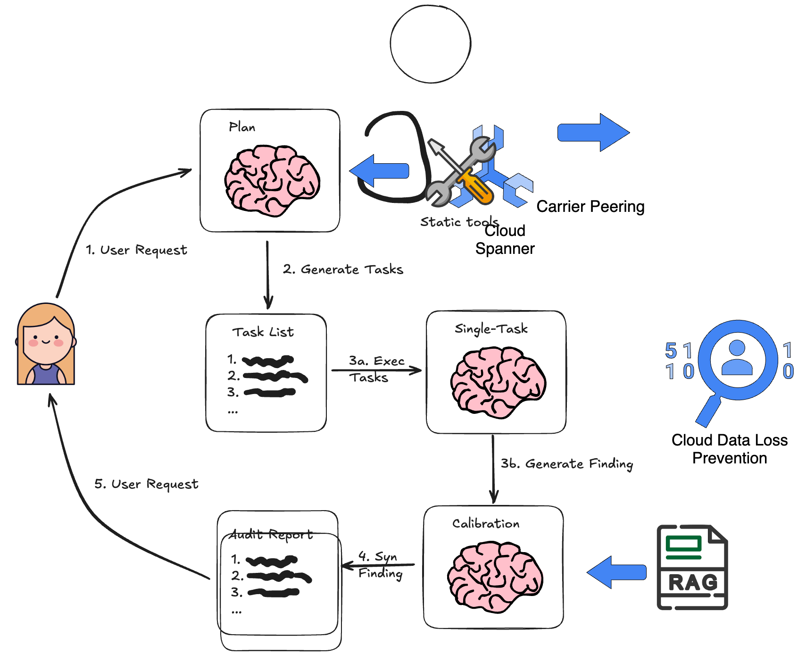
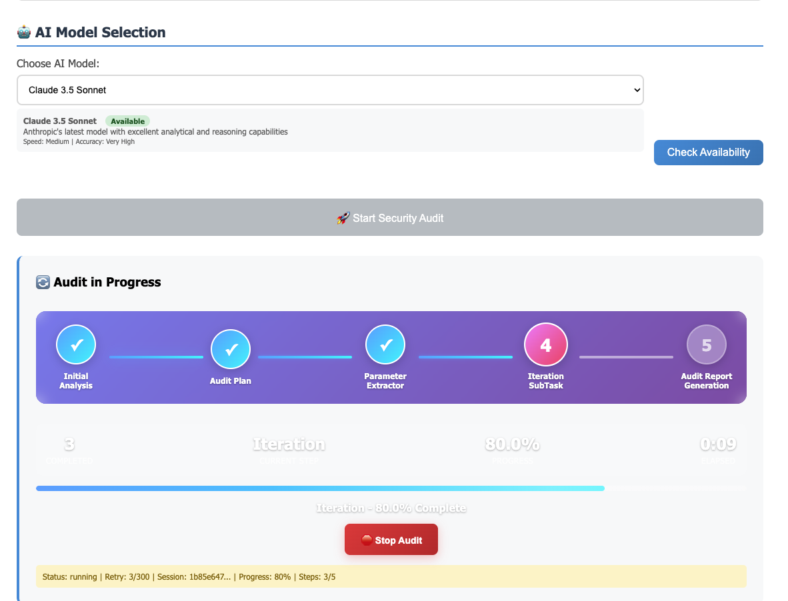
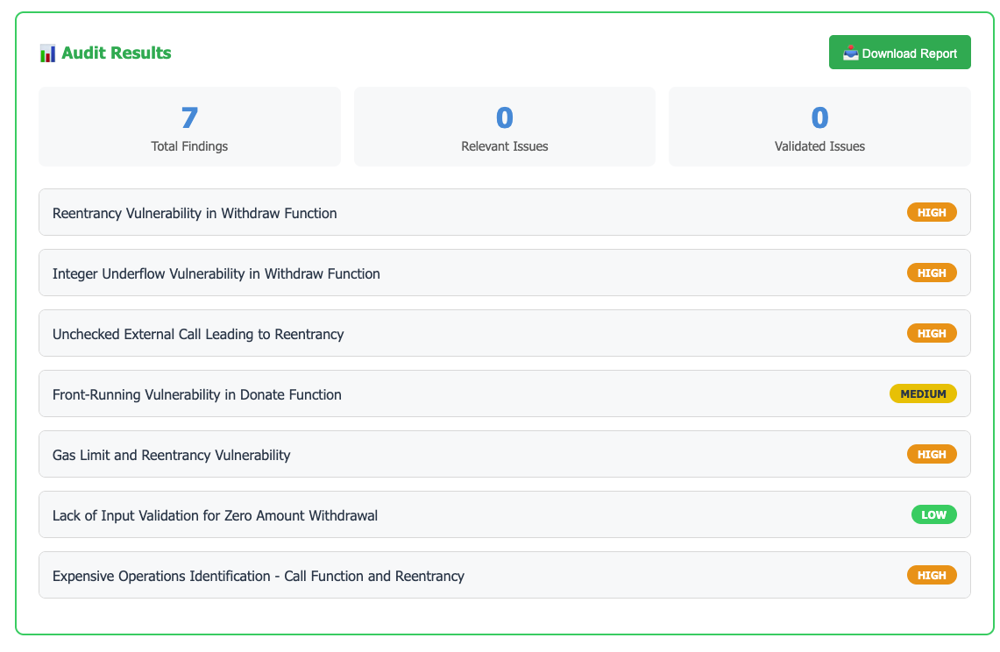

# SmartAuditFlow - Smart Contract Auditing Platform 

<p>
 
</p>

**SmartAuditFlow** is a dynamic and adaptive framework for automated smart contract auditing, leveraging Large Language Models (LLMs) and workflow-driven strategies to deliver reliable, precise, and scalable security analysis.

<details open>
<summary><b>📕 Table of Contents</b></summary>

- 💡 [What is SmartAuditFlow?](#-what-is-smartauditflow)
- 🎮 [Core Concept](#-core-concept)
- 📌 [Source Structure](#-source-structure)
- 🎬 [Get Started](#-get-started)
- 🔧 [Tool Demonstration](#-tool-demonstration)
- 📚 [Citation](#-citation)

</details>

## 🌟 What is SmartAuditFlow?

SmartAuditFlow addresses key limitations in smart contract auditing by orchestrating LLMs within a structured, multi-stage workflow, enabling:

* **Dynamic audit plan customization** for each contract.
* **Iterative execution and refinement** of audit strategies based on intermediate findings.
* **Structured reasoning** and **prompt optimization** to improve LLM performance.
* **Integration with static analyzers** and **Retrieval-Augmented Generation (RAG)** for contextual enrichment.

### 🔍 Core Concept

This framework is inspired by the [Plan-and-Solve](https://aclanthology.org/2023.acl-long.147.pdf) paper as well as the [Baby-AGI](https://github.com/yoheinakajima/babyagi) project.

The framework follows a "plan-and-execute" approach:
1. Create a multi-step audit plan
2. Execute tasks sequentially
3. Refine plan based on intermediate findings

<div align="center">
  
  <br>
  <em>SmartAuditFlow computational graph</em>
</div>

### 🚀 Advantages Over Traditional Methods

This compares to a typical [ReAct](https://arxiv.org/abs/2210.03629) style agent where you think one step at a time. The advantages of this "plan-and-execute" style agent are:

Explicit long term planning (which even really strong LLMs can struggle with)
Ability to use smaller/weaker models for the execution step, only using larger/better models for the planning step

## 📑 Source Link
| Section | Description | Link |
|---------|-------------|------|
| 🛠️ Audit Tool | Main auditing application | [View Code](/smart-contract-audit) |
| 📊 Dataset | Benchmark contracts for evaluation | [View Dataset](/evaluation/contracts) |
| 📈 Results | Performance metrics and analysis | [View Results](/evaluation/results) |
| ✨ Prompt Optimization | Optimal prompt generation code | [View Code](/promptOptimization) |
| 📚 Documentation | Comprehensive user guide | [Read Docs](/wiki) |
| 🐛 Issue Tracker | Report bugs or request features | [View Issues](https://github.com/JimmyLin-afk/SmartAuditFlow/issues) |

## 🚀 Getting Started

```bash
# Clone the repository
git clone https://github.com/JimmyLin-afk/SmartAuditFlow.git
cd SmartAuditFlow

# Install dependencies
pip install -r requirements.txt

# Run the demo (see documentation for details)
```

## 🖥️ Tool Demonstration

#### 1. **Input Code Snippet**
<div align="center">
  
</div>

#### 2. **Audit Process**
<div align="center">
  
</div>

#### 3. **Audit Findings**
<div align="center">
  
</div>

## 📚 Citation

If you use SmartAuditFlow in your research, please cite:

```
@misc{wei2025adaptiveplanexecuteframeworksmart,
      title={Adaptive Plan-Execute Framework for Smart Contract Security Auditing}, 
      author={Zhiyuan Wei and Jing Sun and Zijian Zhang and Zhe Hou and Zixiao Zhao},
      year={2025},
      eprint={2505.15242},
      archivePrefix={arXiv},
      primaryClass={cs.CR},
      url={https://arxiv.org/abs/2505.15242}, 
}
```
