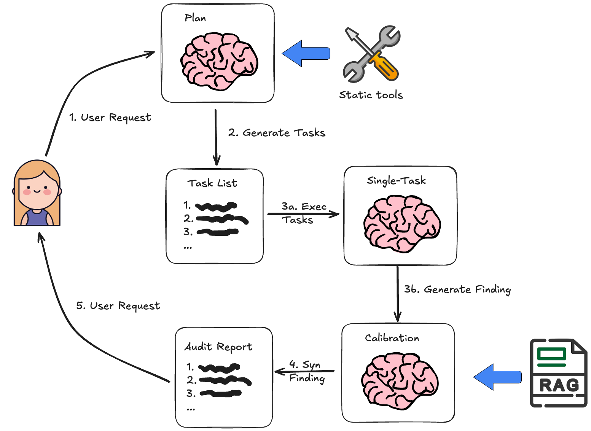

# SmartAuditFlow - Smart Contract Auditing Platform 

<p>
 
</p>

**SmartAuditFlow** is a dynamic and adaptive framework for automated smart contract auditing, leveraging Large Language Models (LLMs) and workflow-driven strategies to deliver reliable, precise, and scalable security analysis.

## Overview

**SmartAuditFlow** addresses these limitations by orchestrating LLMs within a structured, multi-stage workflow, enabling dynamic audit plan generation, iterative reasoning, and integration of external tools for enhanced vulnerability detection.

Key innovations include:

* **Dynamic audit plan customization** for each contract.
* **Iterative execution and refinement** of audit strategies based on intermediate findings.
* **Structured reasoning** and **prompt optimization** to improve LLM performance.
* **Integration with static analyzers** and **Retrieval-Augmented Generation (RAG)** for contextual enrichment.

This framework is inspired by the [Plan-and-Solve](https://aclanthology.org/2023.acl-long.147.pdf) paper as well as the [Baby-AGI](https://github.com/yoheinakajima/babyagi) project.

The core idea is to first come up with a multi-step plan, and then go through that plan one item at a time. After accomplishing a particular task, you can then revisit the plan and modify as appropriate.

The general computational graph looks like the following:

<div align="center">
  
</div>

This compares to a typical [ReAct](https://arxiv.org/abs/2210.03629) style agent where you think one step at a time. The advantages of this "plan-and-execute" style agent are:

Explicit long term planning (which even really strong LLMs can struggle with)
Ability to use smaller/weaker models for the execution step, only using larger/better models for the planning step

## 📑 Quick Links
| Resource | Description | Link |
|----------|-------------|------|
| 📊 Dataset | Explore our benchmark dataset | [View Dataset](https://github.com/JimmyLin-afk/SmartAuditFlow/tree/main/evaluation/contracts) |
| 📈 Evaluation Results | See our tool's performance metrics | [View Results](https://github.com/JimmyLin-afk/SmartAuditFlow/tree/main/evaluation/results) |
| 🛠️ Prompt Optimization | execute code for optimial prompt generate | [View Code](https://github.com/JimmyLin-afk/SmartAuditFlow/tree/main/promptOptimization) |
| 📚 Documentation | Comprehensive guide | [Read Docs](https://github.com/JimmyLin-afk/SmartAuditFlow/wiki) |
| 🐛 Issue Tracker | Report bugs or request features | [Issues](https://github.com/JimmyLin-afk/SmartAuditFlow/issues) |

===========================================
## Getting Started

The source code and instructions are available at:
[https://github.com/JimmyLin-afk/SmartAuditFlow](https://github.com/JimmyLin-afk/SmartAuditFlow)

1. **Clone the repository**

   ```bash
   git clone https://github.com/JimmyLin-afk/SmartAuditFlow.git
   cd SmartAuditFlow
   ```

2. **Install dependencies**
   (See [requirements.txt](./requirements.txt) or the project documentation.)

3. **Run the demo**
   Follow the instructions in the [documentation](./docs/) to perform your first smart contract audit.

## Citation

If you use SmartAuditFlow in your research, please cite:

```
@misc{wei2025adaptiveplanexecuteframeworksmart,
      title={Adaptive Plan-Execute Framework for Smart Contract Security Auditing}, 
      author={Zhiyuan Wei and Jing Sun and Zijian Zhang and Zhe Hou and Zixiao Zhao},
      year={2025},
      eprint={2505.15242},
      archivePrefix={arXiv},
      primaryClass={cs.CR},
      url={https://arxiv.org/abs/2505.15242}, 
}
```
